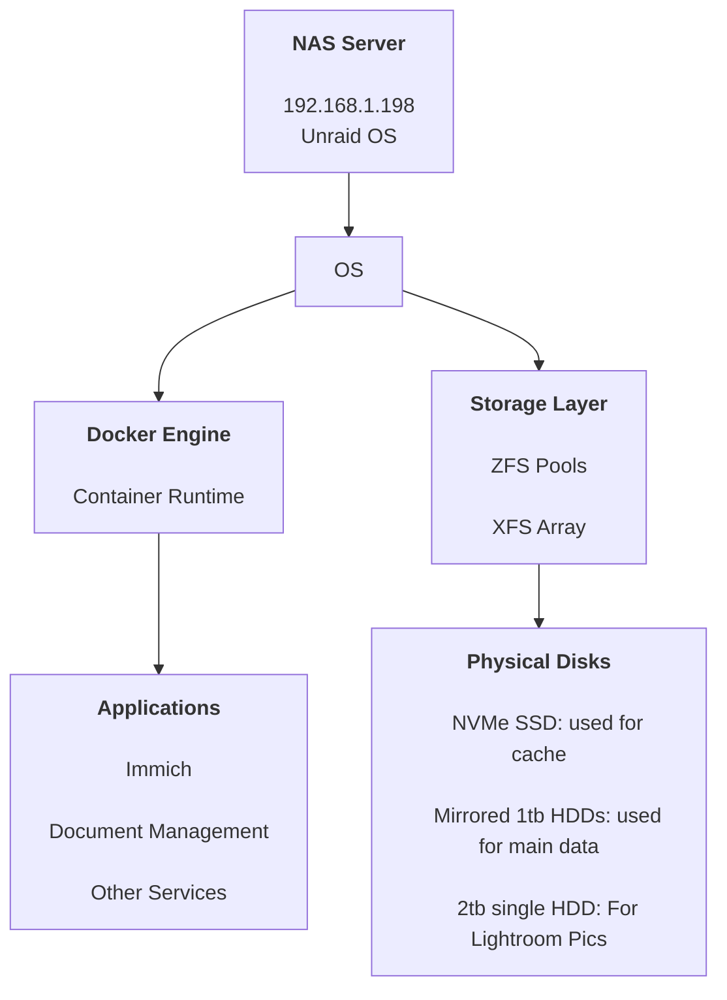

# NAS Internal Architecture

This diagram shows the internal structure of the NAS server, focusing on how
compute, applications, and storage are layered on top of the physical hardware.

## NAS Structure Overview



## Notes

- Unraid provides the host OS and manages disk aggregation and sharing.
- Docker is used to isolate applications and services.
- Applications store persistent data on managed storage pools.
- Physical disks are abstracted away from applications through Unraid.
```
