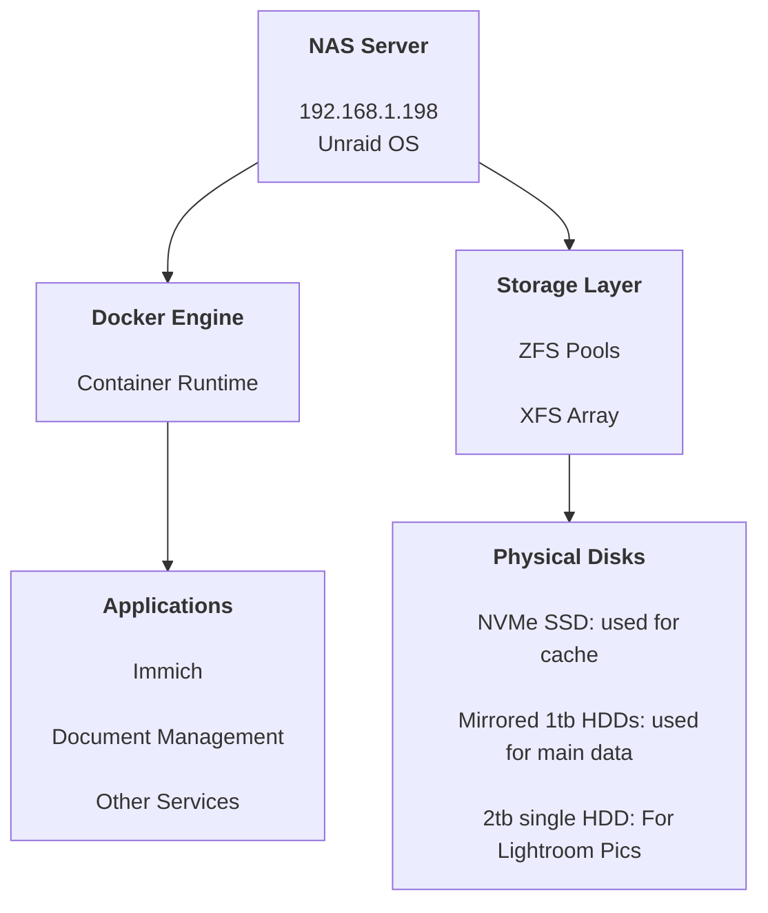

# NAS Internal Architecture
This diagram shows the internal structure of the NAS server, focusing on how
compute, applications, and storage are layered on top of the physical hardware.
- [Purpose and Usage](nas-purpose.md)
- [Roadmap and Future Plans](nas-roadmap.md)
- [Repository Overview](../README.md)

Machine Specs:
 • Dell OptiPlex 7050
 • CPU: Intel i5-6600 (4 cores)
 • RAM: 40 GB DDR4
 • NIC: Intel I219-LM (1 Gbps)
Storage
 • Boot Device: 64 GB USB drive
 • Cache Pool (ZFS): Fanxiang S501 256 GB NVMe SSD
 • Mirror Pool “Studymirror” (ZFS mirror):
    -Seagate 1 TB HDD
    -Seagate 1 TB HDD

 • Additional Storage Pool “Bigpool”:
    -2 TB HDD (ZFS single disk)
 • Array Disk:
    -500 GB HGST HDD (XFS)


Primary Storage Strategy
 • Fast data, databases, and containers on cache SSD
 • Long-term persistent files on 1 TB mirrored ZFS pool
 • Optional bulk storage on 2 TB Bigpool
## NAS Structure Overview



## Notes

- Unraid provides the host OS and manages disk aggregation and sharing.
- Docker is used to isolate applications and services.
- Applications store persistent data on managed storage pools.
- Physical disks are abstracted away from applications through Unraid.
```
