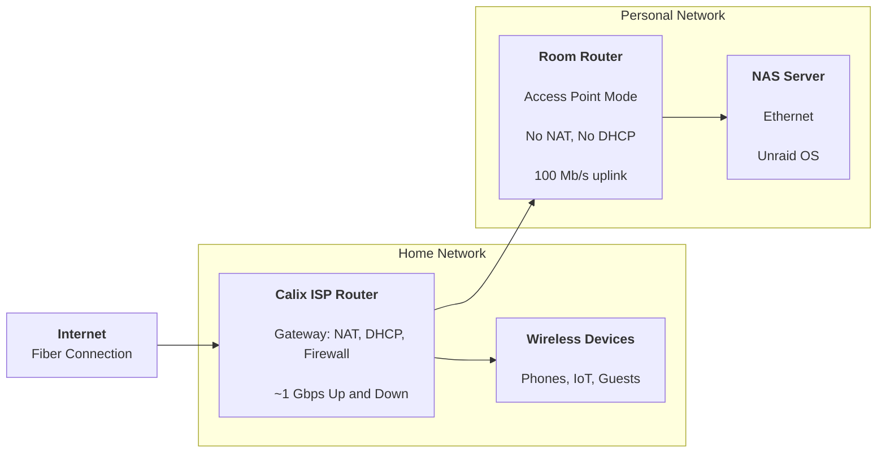

```mermaid
flowchart LR
    Internet[<b>Internet</b><br/>Fiber Connection]

    subgraph ISP["Home Network"]
        Calix[
        <b>Calix ISP Router</b><br/>
        Gateway: NAT, DHCP, Firewall<br/>
        ~1 Gbps Up and Down
        ]
        Wireless[
        <b>Wireless Devices</b><br/>
        Phones, IoT, Guests
        ]
    end

    subgraph Home["Personal Network"]
        RoomRouter[
        <b>Room Router</b><br/>
        Access Point Mode<br/>
        No NAT, No DHCP<br/>
        100 Mb/s uplink
        ]
        NAS[
        <b>NAS Server</b><br/>
        Ethernet<br/>
        Unraid OS
        ]
    end

    Internet --> Calix
    Calix --> RoomRouter
    Calix --> Wireless
    RoomRouter --> NAS
```
