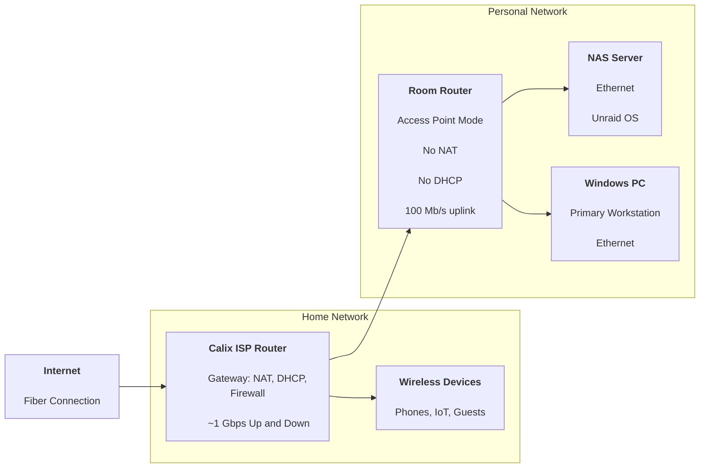

```mermaid
flowchart LR
    %% Internet
    Internet[
    <b>Internet</b><br/>
    Fiber Connection
    ]

    %% Home / ISP Network
    subgraph ISP["Home Network"]
        Calix[
        <b>Calix ISP Router</b><br/>
        Gateway: NAT, DHCP, Firewall<br/>
        ~1 Gbps Up and Down
        ]

        Wireless[
        <b>Wireless Devices</b><br/>
        Phones, IoT, Guests
        ]
    end

    %% Personal Network
    subgraph Personal["Personal Network"]
        RoomRouter[
        <b>Room Router</b><br/>
        Access Point Mode<br/>
        No NAT<br/>
        No DHCP<br/>
        100 Mb/s uplink
        ]

        NAS[
        <b>NAS Server</b><br/>
        Ethernet<br/>
        Unraid OS
        ]

        PC[
        <b>Windows PC</b><br/>
        Primary Workstation<br/>
        Ethernet
        ]
    end

    %% Connections
    Internet --> Calix
    Calix --> RoomRouter
    Calix --> Wireless
    RoomRouter --> NAS
    RoomRouter --> PC
click NAS "nas-structure.md"

```
