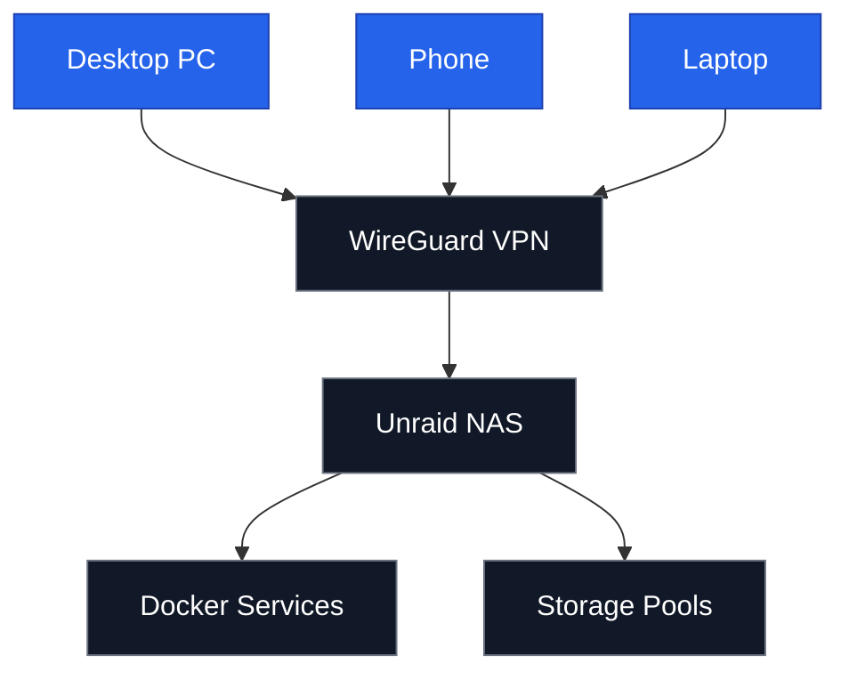

```mermaid
flowchart TD
    %% Clients
    PC[Desktop PC]
    Phone[Phone]
    Laptop[Laptop]

    %% Core infrastructure
    VPN[WireGuard VPN]
    NAS[Unraid NAS]
    Docker[Docker Services]
    Storage[Storage Pools]

    %% Connections
    PC --> VPN
    Phone --> VPN
    Laptop --> VPN

    VPN --> NAS
    NAS --> Docker
    NAS --> Storage

    %% Clickable links
    click NAS "hardware.md"
    click Storage "storage.md"
    click Docker "services.md"
    click VPN "networking.md"

    %% Styles
    classDef client fill:#2563eb,stroke:#1e40af,color:#ffffff
    classDef core fill:#111827,stroke:#6b7280,color:#ffffff

    %% Class assignments
    class PC,Phone,Laptop client
    class NAS,VPN,Docker,Storage core
```
