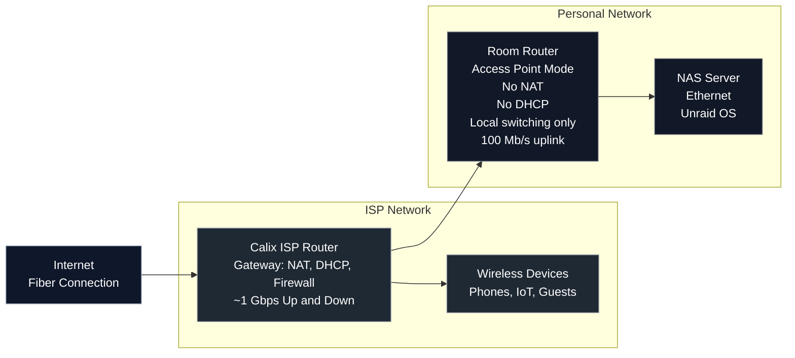

```mermaid
flowchart LR
    %% Internet
    Internet[Internet<br/>Fiber Connection]

    %% ISP Network
    subgraph ISP["ISP Network"]
        Calix[Calix ISP Router<br/>Gateway: NAT, DHCP, Firewall<br/>~1 Gbps Up and Down]
        Wireless[Wireless Devices<br/>Phones, IoT, Guests]
    end

    %% Personal Network
    subgraph Home["Personal Network"]
        RoomRouter[Room Router<br/>Access Point Mode<br/>No NAT<br/>No DHCP<br/>Local switching only<br/>100 Mb/s uplink]
        NAS[NAS Server<br/>Ethernet<br/>Unraid OS]
    end

    %% Connections
    Internet --> Calix
    Calix --> RoomRouter
    Calix --> Wireless
    RoomRouter --> NAS

    %% Styling
    classDef isp fill:#1f2933,stroke:#9ca3af,color:#ffffff
    classDef home fill:#111827,stroke:#6b7280,color:#ffffff
    classDef edge fill:#0f172a,stroke:#94a3b8,color:#ffffff

    class Calix,Wireless isp
    class RoomRouter,NAS home
    class Internet edge
```
